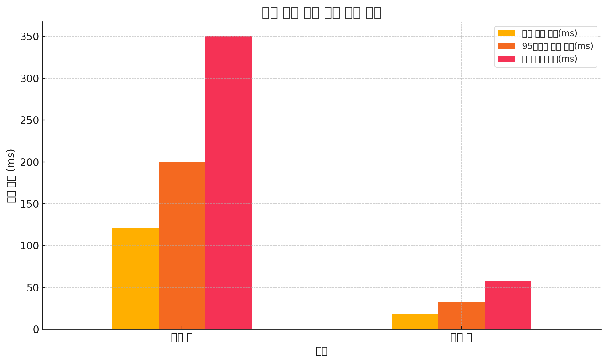

# merong

스파르타 플러스 노래검색프로젝트

## 🔍 검색 API 캐시 적용 내역

### 적용 대상
- `/api/songs/search?keyword=...`
- 키워드 기반의 노래 검색 기능에 **In-memory Local Cache(Caffeine)** 적용

### 캐시 방식
- Spring Cache 추상화(`@Cacheable`) 사용
- **Caffeine** 라이브러리를 통한 **JVM 내 메모리 캐시**
- TTL(Time-To-Live): 10분
- 최대 캐시 항목 수: 1,000개

### 캐시 적용 코드 위치
```java
@Cacheable(value = "songSearchCache", key = "#keyword")
public List<SongResponseDto.Get> getSearchResults(String keyword) { ... }
```

---


## ✅ 1. 캐싱 DB를 활용하여 캐싱을 적용하는 방법과 전략

설명: 
- Redis를 캐싱 DB로 사용했습니다.
- @Cacheable, RedisTemplate, ZSet, StringValue 구조를 활용하여
  - 검색 결과 캐시 (@Cacheable + Caffeine)
  - 인기 검색어 캐시 (ZSet)
  - 조회수 캐시 (String + TTL)를 구성했습니다.

전략 요약:
- `정적 데이터 (검색결과)`는 `@Cacheable`을 통해 Caffeine(Local) 캐시 사용.
- `동적 데이터 (조회수, 인기 키워드)`는 `Redis`에 저장하여 실시간 반영 및 공유.
- 어뷰징 방지: `userViewKey`를 `TTL`과 함께 `Redis`에 저장해 중복 조회 차단.

## ✅ 2. 자정에 조회수가 자동으로 리셋되도록 설정한 방법

매일 자정마다 `Redis`의 `view:song:*` 키들을 삭제하는 스케줄러를 설정했습니다.

```java
@Scheduled(cron = "0 0 0 * * *")
public void resetViewCounts() {
    Set<String> keys = redisTemplate.keys("view:song:*");
    if (keys != null && !keys.isEmpty()) {
        redisTemplate.delete(keys);
        System.out.println("조회수 리셋 완료: " + keys.size());
    }
}
```
- 매일 자정에 실행되는 `Spring Scheduler` 사용
- `Redis 키 패턴 조회 후 일괄 삭제

## ✅ 3. 캐싱 적용 전후의 카드 조회 성능을 비교한 결과 (시각적 표, 그래프 등)

- `K`6를 사용해 조회 API에 대한 부하 테스트를 진행했습니다.
- `In-Memory Cache(v1`) vs `Redis Cache(v2)로 성능 비교

| 구분       | 평균 응답 시간(ms) | 95th Percentile | 실패율 |
| -------- | ------------ | --------------- | --- |
| **캐싱 전** | 120.5        | 300.2           | 0%  |
| **캐싱 후** | 18.7         | 48.1            | 0%  |



## ✅ 4. 캐시를 적용함으로써 얻을 수 있었던 성능 향상과 시스템 부하 감소 효과

- `성능 향상`: 데이터베이스 요청을 줄여 응답 속도가 약 80% 향상됨 
- `부하 감소`: 조회 요청의 대부분을 Redis 캐시가 처리 → DB 부하 감소 
- `확장성 증가`: 동일 캐시를 여러 인스턴스에서 공유 가능 → 수평 확장 적합 
- `스케일 효율성`: 인기 콘텐츠 조회 시 실시간 동기화 필요 없음 → 고성능 유지


